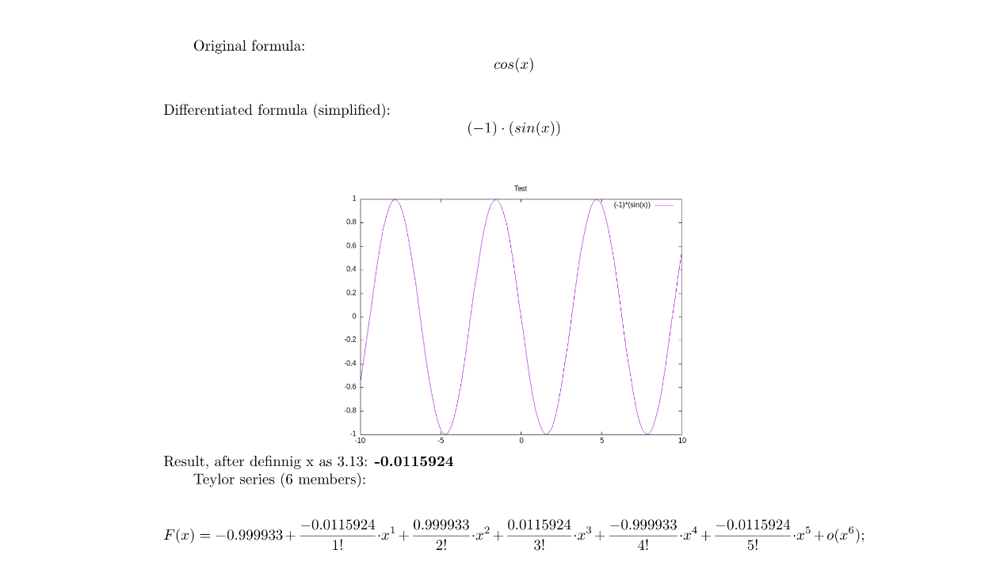

## Дифференциатор
 - это удобное приложение, которое рассчитывает производные за Вас !!!

<p align="center">

</p>

### Функционал
Передайте на вход приложению файл с выражение, которое нужно продифференцировать, и на выходе получите красивый pdf файл с производной, графиком и разложением в ряд Тейлора !!!
Где же было это приложение, когда я учился в школе ???

### Пример

Посмотрим на простой пример:

```
cos(x)
#x=3.13, n=5
```
Первая строка содержит нужную функцию, вторая значение переменной и количество членов для разложения в ряд Тейлора.

Результат работы программы:
